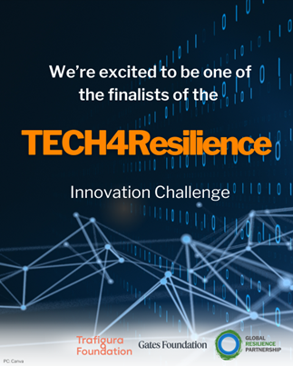

## 2025

  

    

    We are thrilled to share that <strong>NUST’s research idea, <em>“Intelligent Resilience through Active Learning (ResilientSIGHT)”</em></strong>, has been selected as one of the 15 global finalists of the <strong>TECH4Resilience Challenge 2025</strong>, organized by the 
    <a href="https://www.globalresiliencepartnership.org/announcing-the-finalists-of-the-tech4resilience-challenge/" target="_blank">
    Global Resilience Partnership (GRP)
    </a>.
    

    

    The team included <strong>Dr. Inayat Ullah (Team Lead)</strong>, <strong>Dr. Faisal Abbas</strong>, <strong>Dr. Sohail Iqbal</strong>, <strong>Ms. Sheeba Tariq</strong>, and <strong>Mr. Salah ud Din</strong>.
    

    

    Following a <strong>highly competitive selection process</strong>—with over <strong>300 applications</strong> from around the world—the finalists represent some of the most innovative uses of 
    <strong>technology and artificial intelligence for climate resilience</strong>.
    

    

    Winners will be announced at <strong>COP30</strong> at the <strong>Resilience Hub</strong>, where finalists will compete for up to <strong>USD 50,000</strong> in funding, alongside technical support for implementation, monitoring, and long-term impact.
    

  

  

    
  

## Conference Presentations

Following is a selection of my conference presentations over the years:

## 2024

- _International Conference of Young Scientist: Transformative and Inclusive Science for a Sustainable Future_,  
  National Academy of Sciences, Washington D.C., USA, **May 4–11, 2024**

## 2023

- _Asian Economic Development Conference (AECD): Asia’s Recovery and the Future of Globalization_,  
  University of Tokyo, Japan, **July 15–16, 2023**
- _ADB-IEA Innovative Policy Award Session_, ADB Annual Meetings, Incheon, South Korea, **May 5, 2023**
- _ISEF Research Seminar_, Chey Institute of Advanced Studies (CIAS), Seoul, South Korea, **August 16, 2023**
- _Seminar on Impact Evaluation of Development Interventions in Pakistan: A Case Study of IMU_,  
  School of Economics, Quaid-i-Azam University, Islamabad, **March 31, 2023**

## 2021

- _Agribusiness Innovations for Sustainable Rural Community Development_,  
  Asian Productivity Organization (Japan), **March 24–26, 2021**

## 2020

- _IFIP EGOV-CeDEM-ePart 2020 Conference_, Linköping University, Sweden, **September 1–2, 2020**

## 2019

- _Society for Research on Educational Effectiveness (SREE) 2019 Conference_,  
  Washington D.C., USA, **March 6–9, 2019**

## 2018

- _Asian and Australasian Society of Labour Economics (AASLE)_, Seoul National University, South Korea, **December 13–15, 2018**
- _KDI School and 3ie Conference on Impact Evaluation in Development Research_, Seoul, South Korea, **November 22–23, 2018**
- _Brown Bag Seminar_, Korea Development Institute (KDI) School of Public Policy and Management, Sejong City, South Korea, **December 4, 2018**
